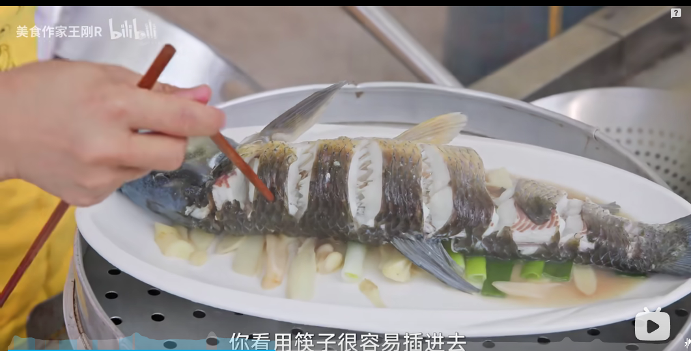

# 清蒸鲈鱼的做法

## 必备原料和工具

- 鲈鱼（害怕杀鱼的同学可以让店家帮忙杀）
- 香葱
- 姜
- 食用油
- 蒸鱼豉油
- 料酒
- 食用盐

## 计算

每份：

- 鲈鱼 一条
- 香葱 三根
- 姜 一块
- 食用油 10-15ml
- 蒸鱼豉油 10-15ml
- 料酒 10-15ml
- 食用盐 5-10g

## 操作

- 姜切片切丝、香葱的葱白切段，葱绿切丝，切丝后放入冷水浸泡备用。
- 鲈鱼处理好后洗净，用厨房纸擦干，两面分别划几刀，用盐洗掉鱼身的粘液，并用 10g 盐抹遍鱼身的内外，腌制 10 分钟以上。
- 补充一个鲈鱼改刀和摆盘的方法，改刀后可以让鲈鱼立起来蒸，均匀受热，同时吃起来更加方便，无需翻面。
- 
- 
- 鱼肚内塞上姜和葱白，鱼身也撒上姜和葱白，量为备用的一半。蒸鱼的碟子用筷子将鱼跟碟子隔开蒸
- **补充**：如果不用筷子隔开蒸，要在鱼下面垫一层姜葱，大小适中，垫高再蒸（1、下面镂空可以蒸得上 2、可以和蒸鱼过程中产生得血水分离）
- 
- 水烧热感觉到水温后放进入鱼
- 大火清蒸 10-13 分钟，用筷子在最厚的地方可以扎进去立起来就代表熟了。
- 
- 蒸好的鱼，倒掉盘底的血水，用干净的盘子装起来并去除身上姜蒜
- 
- 如果有蒸鱼豉油
  - 鱼身浇上 15ml 蒸鱼豉油
  - 鱼身重新撒上姜和葱丝，锅内加上 10ml 食用油并烧热，将食用油淋至鱼身即可出菜
- 如果没有蒸鱼豉油
  - 鱼身重新撒上姜和葱丝，锅内加上 15ml 食用油并烧热，将食用油淋至鱼身（油多一点可以给鱼保温）
    
  - 倒入 15ml 酱油（1 满勺）在锅里加热，热成熟酱油，一旦气泡就关火，不要煮久了，泼熟酱油淋至鱼身
    

## 附加内容

- 技术总结：
  - 这道菜属于有手就行，关键点在于火候，鱼的大小跟火候都会相关，太久会导致鱼肉太老极度影响口感，太短会导致部分鱼肉没熟。所以大火蒸鱼一般是 10 分钟内较佳。
  - 切记蒸鱼需要用筷子隔开装鱼的盘子，这样做的好处有两点：
    - 1、鱼在蒸的过程中会将血水滴到盘子，如果鱼直接接触会导致鱼食用时会腥。
    - 2、能够将鱼均匀受热。
  - 这道菜难度系数简单，而且味道非常棒哦

如果您遵循本指南的制作流程而发现有问题或可以改进的流程，请提出 Issue 或 Pull request 。

## 参考

- https://www.bilibili.com/video/BV1BLCRYYENZ/ 王刚清蒸瘦身草鱼

> “瘦身鱼”是将常规池塘养成的腹部肥厚、鱼体脂肪过多的商品鱼放入优质洁净水源中节食或者停食，饥饿处理数月，实现体重迅速下降的过程，也是消除腥味、改善外观、提升品质的过程。“瘦身”后的鱼具有体色光鲜、无泥味、少脂肪、无药残、口感好、质量佳等特点。

> 池塘之类的地方养的鱼，膘肥体壮。刚打上来做道菜，尝尝它的鱼肚，你多半 yue 出来。这是因为鱼在池塘里吃微生物和藻类，体内囤积了土臭素和 2-甲基异莰醇，脂肪部位尤其多。但是在清水里养半个月，就能基本去除掉这些东西

> 主要是为了去河鲜的土腥味，土腥味主要来源就是水质，瘦身，说白了就是用“好水”来“净化”这条鱼

> 鱼不一定非要养瘦，只需把泥腥味去除了就行。带有泥腥味的鱼一般是鱼塘里养殖的鱼或者水质比较差的河鱼，水质比较好的河或者水库里的鱼泥腥味就没有或者很淡，我们这边是能买到水库的鱼就买水库的，买不到才去买瘦身鱼。
