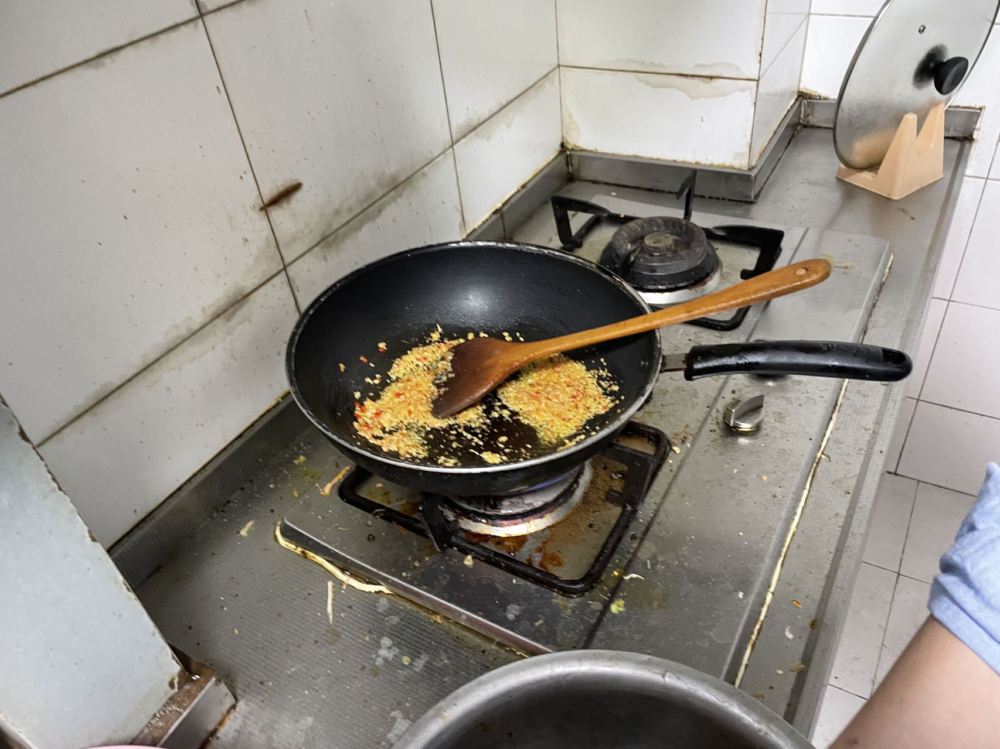
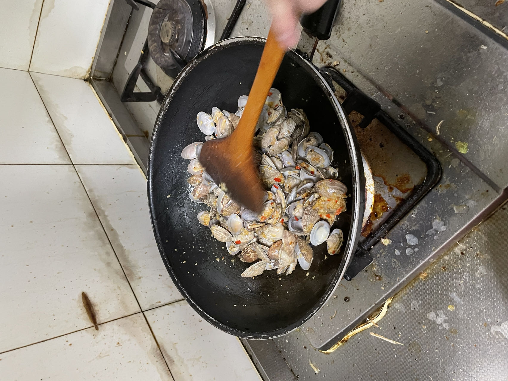
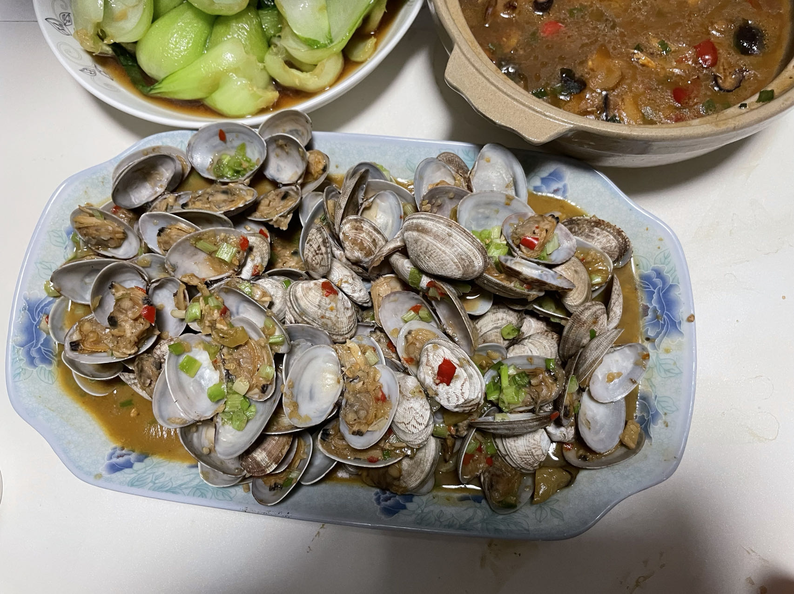

# 辣炒花蛤的做法

## 必备原料和工具

- 花蛤
- 食盐
- 食用油
- 姜、蒜、小米辣
- 小葱

## 计算

每份：

- 花蛤 1500 g
- 姜 5 片（长的）
- 蒜 1 团
- 小米辣 2 个
- 食用油 5 g

## 操作

- 花蛤加清水加盐浸泡 30 分钟，清洗将沙子吐干净
- 姜、蒜、小米辣用器具切碎（越碎越好）
- 冷水起锅，花蛤焯水，水开后撇掉浮沫，用温水冲洗干净
- 锅中倒入食用油，油温要够热时，放入一半的姜、蒜、小米辣爆香，蒜白颜色转黄时放入花蛤翻炒
- 花蛤全部开口后，放入另一半姜、蒜、小米辣，加盐，翻炒
- 加入适量热水，翻炒，留作汤汁
- 大火收汁，关火，撒上葱花

## 附加内容

如果您遵循本指南的制作流程而发现有问题或可以改进的流程，请提出 Issue 或 Pull request 。

## 自己做的

<!--  -->
