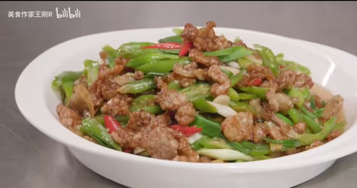

# 小炒五花肉的做法

## 必备原料和工具

- 五花肉
- 朝天椒
- 小米椒
- 豆豉
- 豆瓣酱
- 老抽
- 淀粉
- 盐
- 葱
- 蒜

## 计算

每份：

- 五花肉 500g
- 朝天椒 4 条
- 小米椒 1 颗
- 豆豉 10g，根据个人口味加减 ±5g
- 豆瓣酱 10g，根据个人口味加减 ±5g
- 老抽 10ml
- 淀粉 10g
- 盐 1-2g
- 葱 0.5-1 根
- 姜 2 片
- 蒜 2 瓣
- 食用油 15ml
- 胡椒粉 1g
- 干淀粉 5g
- 味精 1g

## 操作

### 准备食材

腌制五花肉

1. 将较瘦的部分切下来，带皮肥肉部分放入冰箱急冻 1 小时
2. 较瘦部分切薄片放入碗中，加入清水洗净捞出挤干水分放回碗里
3. 加入盐、胡椒粉、生抽酱油、老抽抓至收干味汁〈中途加入蛋清抓匀〉，加入干淀粉抓匀备用，腌制半小时

### 开始制作

- 葱切段
- 小米椒、朝天椒斜刀切好
- 热锅、加入少许底油，倒入肥肉片炒出猪油，炒至变色后盛出来（至七成熟）
- 向锅中加入姜片、蒜片爆香，煸出香味，加入豆豉，翻炒均匀
- 加入豆瓣酱，味精，锅边淋入生抽酱油，翻炒均匀
- 加入炒好的五花肉继续的翻炒均匀
- 加入小米椒、朝天椒、葱段翻炒 40 秒（炒至断生）
- 出锅。

### 技术总结：

〈1〉将五花肉肥瘦分开，肥肉冻硬再切薄片爆香，可以解决太肥过腻的口感

〈2〉切好的瘦肉腌制上浆，能保证成菜较嫩的口感

〈3〉爆辣椒时必须开大火，小火会导致辣椒出水，造成成菜没有椒香味

## 附加内容

如果您遵循本指南的制作流程而发现有问题或可以改进的流程，请提出 Issue 或 Pull request 。
