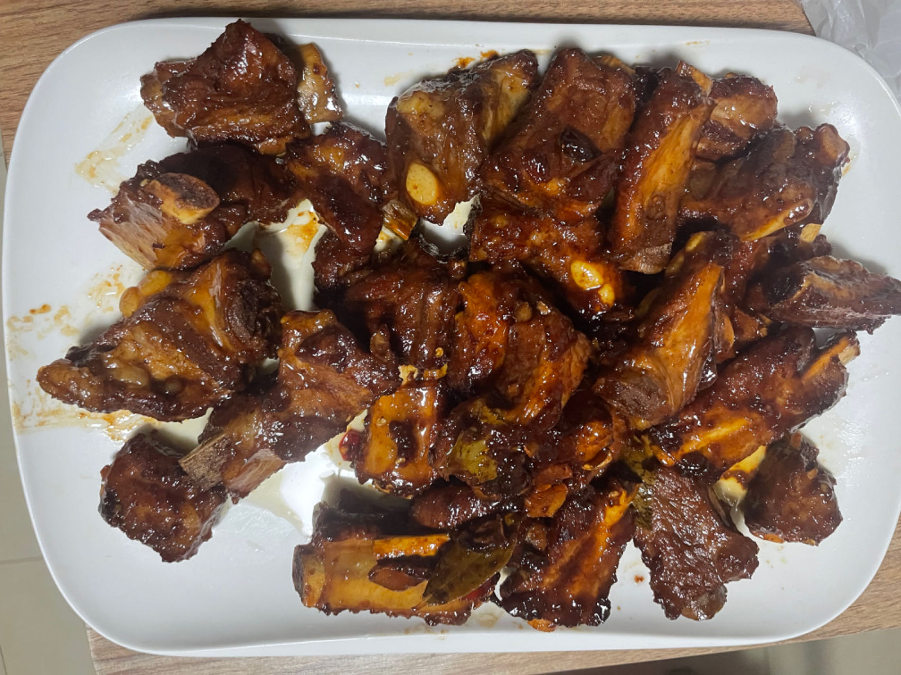
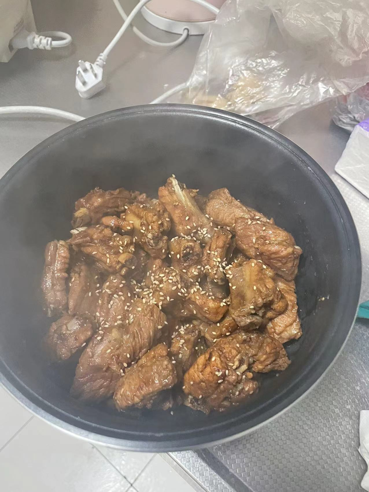

# 红烧排骨的做法

## 必备原料及工具

- 排骨（小肋排最佳）
- 植物油、生抽酱油、老抽酱油、米酒、盐
- 姜、小米辣、葱、（可选）
- 白砂糖
- 桂皮、八角、香叶、白胡椒粉

## 计算

- 排骨（1kg）
- 盐两勺
- 白砂糖 1.5 勺
- 姜 6 片、小米辣 2 个
- 桂皮两个、八角 2 颗、香叶 2 片

## 操作

- 准备排骨：排骨切成 5 厘米的小块，排骨用清水浸泡 5 分钟后，冲洗几次除掉血水。焯水，排骨凉水入锅，同时放入 3 片姜和料酒，水开后焯水一分钟，姜排骨捞出，注意用温水（注意温水）清洗干净，控干水份，等待使用
- 排骨上色：倒入少量冷油和 1.5 勺冰糖，小火加热不停搅拌，糖敖化后等到有白色小泡泡冒出并变成红棕色即可（不要熬太久产生焦糊的苦味），加入排骨翻炒上色
- 排骨爆香：加入姜片、小米辣、桂皮，香叶、白胡椒粉，爆香后加入两勺盐，2 勺米酒盖锅焖一会
- 大火烧开：加入生抽，加入开水，末过排骨即可（不能用冷水），水开后若有浮沫漂浮去掉，再加入老抽上色，大火烧 20 分钟 （人在旁边看着，以防糊锅，准备好备用的开水）
- 小火炖煮：转小火，观察收汁情况，以防糊锅，锅中剩余 1/3 的汤汁时，可加入少量白糖，再加入盐调味（如果发现盐淡）
- 收汁：大火收汁，期间不停翻炒，使得汤汁均匀裹到排骨表面
- 加少许葱花点缀，出锅盛盘

## 经验总结

- 炒糖色用小火，大火容易炒糊

