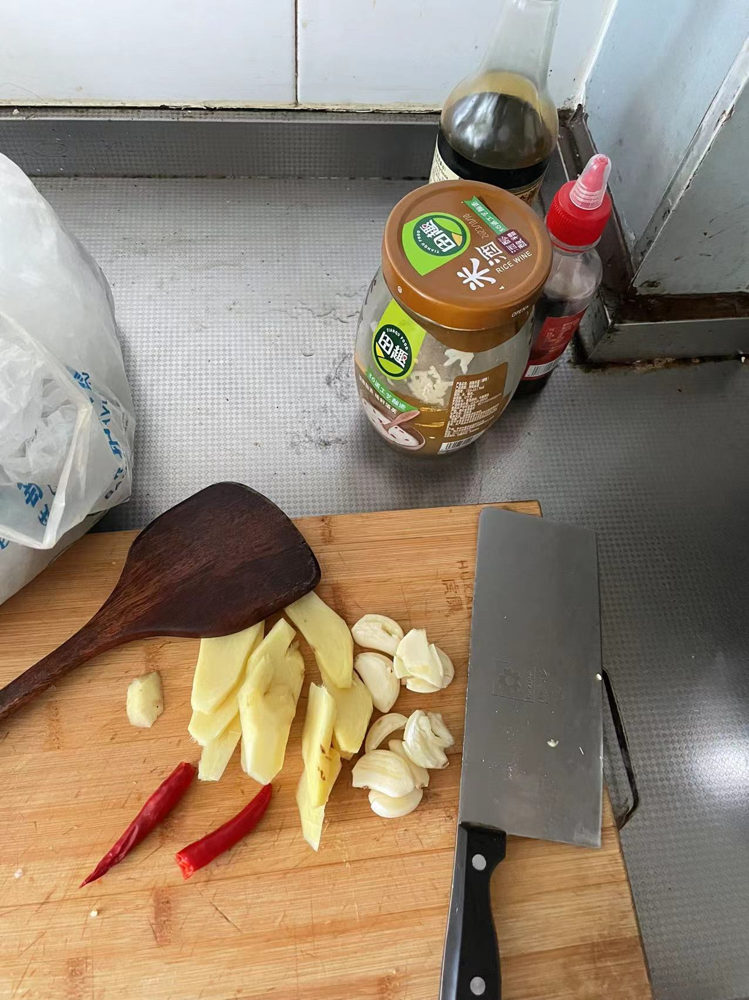

# 红烧牛肉的做法

红烧牛肉和红烧肉的做法大同小异，只是肉的品种不同。

## 必备原料和工具

- 注：如果有可能，请尽量把刀磨的锋利一些。
- 工具：`锅`（砂锅为宜，铝锅其次，高压锅也可以，最好不要铁锅、铜锅）
- 主料：`牛肉`
- 辅料：`油`、`冰糖`、`老抽`、`料酒`、`香叶`、`八角`、`生姜`、`盐`、`葱`、`开水`、`凉水`、`蒜`、`花椒`、`香菇`、`桂皮`、`肉蔻`

## 计算

- 牛腱子肉：约 6 斤
- 油：100-150ml，菜籽油
- 姜： 8 片
- 大蒜： 半团
- 小米辣： 1 个
- 香菇： 12 个
- 白砂糖：10g
- 老抽：15ml
- 料酒：20ml
- 开水：没过食材的量即可，看锅大小准备
- 八角：2 个
- 香叶：3 片
- 花椒：10g
- 桂皮：10g
- 肉蔻：1 个
- 白胡椒粉：5 g
- 盐：3 勺

## 操作

建议在此之前查看炒[糖色](./../../condiment/糖色.md)教程

- `牛肉`切块（约 3cm ）
- `生姜`切片（每片厚度约 3mm ）
- `开水`烧开
- `小葱`小葱白色的部分`葱白`切成小段（小葱最佳，大葱也可以）
- `蒜`中间切开，不要拍扁，否则难以捞出以至最后`收汁`时影响味道
- 建议先拿出来一半葱姜，再将剩下的`生姜、葱白、蒜、花椒、八角、香叶`提前放入一个碗中备用
- 凉水锅中放入切好的牛肉，加入料酒与 2/5 葱姜，煮开去掉血腥，捞出来后用温水洗干净，保留原汤；
- 炒[糖色](./../../condiment/糖色.md)，注意采用其中提到的操作 2 来制作糖色（也可省略用成瓶的冰糖糖色汁加白糖替代）。
- 将准备好的`生姜、葱白、蒜`还有`牛肉肉`倒入锅中`大火`翻炒，期间加入料酒 10 ml（或米酒）至闻到香味，加入三勺盐后焖 5 分钟，使其入味
- 加入料汁水（八角，香叶，桂皮，花椒，肉蔻），加入香菇，倒入原汤（不够再补开水）至没过全部肉开始炖煮
- 盖上锅盖煮至沸腾后，将浮在表面的油和沫捞出，然后可加入白胡椒粉（在这一步加而不是上一步有益于白胡椒粉与浮沫分离）；
- 转小火炖煮，时间 50 分钟-60 分钟
- 当水的高度减至肉最高的高度与锅底高度的 3/5 时，转中火，并捞出除肉和水以外的所有辅料，开始收汁；
- 打开锅盖，待汤汁快没有的时粘稠状出锅（切记不可收干）；

## 我的记录

注意：

1. 使用的八角不宜过多，香料尽量切大块（姜切大条，蒜整瓣或分两瓣）可以在收汁阶段捞出；
2. 炒牛肉还未开始炖煮的时候，尽量保持牛肉的干爽，这样炖煮出来的牛肉口感更佳。

## 附加内容

如果您遵循本指南的制作流程而发现有问题或可以改进的流程，请提出 Issue 或 Pull request 。
