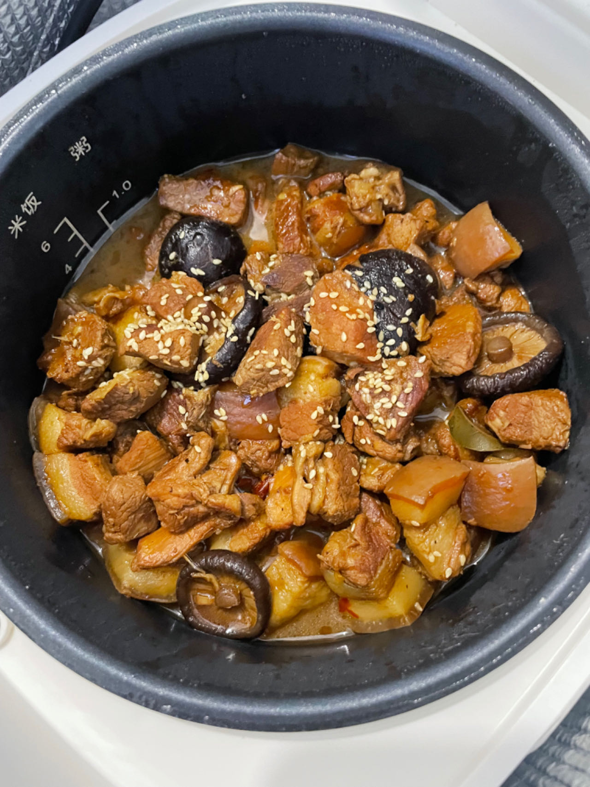
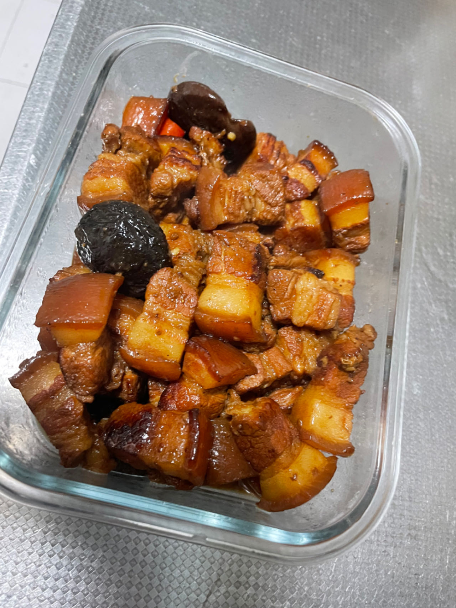

# 南派红烧肉的做法

这份红烧肉教程是一道新手不败的菜谱。配着米饭好吃的停不下来，香糯无敌棒色泽诱人肥而不腻

## 必备原料和工具

- 注：如果有可能，请尽量把刀磨的锋利一些。
- 工具：`锅`（砂锅为宜，铝锅其次，高压锅也可以，最好不要铁锅、铜锅）
- 主料：`五花肉`
- 辅料：` 小葱`、`香菇` 、`油`、`冰糖`、`老抽`、`料酒`、`生姜`、`盐`、`小葱`
- 香料：`八角`、`香叶`、`桂皮`、`肉蔻`、`白胡椒粉`
- 准备`开水`

## 计算

一份正好够 1-3 人吃。

- 猪五花肉：约 2 斤
- 油：越少越好，避免油腻
- 姜： 3 片
- 香菇： 8 个
- 冰糖：适量取几块
- 白砂糖：10g
- 老抽：15ml
- 料酒：20ml（可以米酒代替）
- 开水：没过食材的量即可，看锅大小准备
- 八角：1 个 （每两斤来一个，参考 6 斤用 3 个）
- 香叶：2 片 （无论多少只两片）
- 桂皮：10g （无论多少只一片）
- 肉蔻：1 个（无论多少只一个）
- 白胡椒粉：5g
- 盐：适量

## 操作

建议在此之前查看炒[糖色](./../../condiment/糖色.md)教程

### 准备食材

主料

- `猪五花肉` 切掉多余的瘦肉，肥瘦相间的五花冷冻半小时至一小时后，上火烫猪皮，用刀刮掉猪毛，拿刷子清洗干净猪皮表面的焦黑色，把整块肉先切长条后改刀切大块（约 4.5cm 麻将大小）

配料

- `生姜`切片（每片厚度约 3mm ）
- `小葱`分两份，一份挽成结，另一份切成葱花出锅撒
- `八角、香叶、桂皮、肉蔻、白胡椒粉` 提前放入一个碗中备用，碗中可以加适量水
- `开水`烧开

### 开始制作

- 凉水起锅，放入切好的五花肉，煮开后撇去浮沫，将肉捞出捞出来后用温水洗干净；
- 锅里少放油（只要能润到锅就行），把肉倒进去爆炒，炒出油脂，炒至肉表面微黄，将肉捞出备用；
- 准备炒[糖色](./../../condiment/糖色.md)，注意采用其中提到的操作 2 来制作糖色。
  - 水炒糖色，炒到变红有小炮出现，立即加入 200ml 开水，糖色水即成（没有味道的糖色刚刚好）
- 放肉下到糖水里，加入姜葱，加入总量的 2/3 盐调底味，加入料酒，盖上锅盖焖 5 分钟，使其入味
- 开锅，加入开水，没过全部肉，等水开后撇去上面的油沫；
- 加入料汁水（八角，香叶，桂皮，白胡椒粉，肉蔻），加入香菇，加上白砂糖，盖上锅盖小火炖煮 40-50 分钟；
- 开锅并捞出除肉和水以外的所有辅料，开始收汁；
- 等待收汁情况，轻轻翻炒几下，待汤汁快没有的时粘稠状出锅（切记不可收干）；

> 目标：一点不腻，肥瘦相间，火候正好，入口即化

## 附加内容

如果您遵循本指南的制作流程而发现有问题或可以改进的流程，请提出 Issue 或 Pull request 。

## 我的记录

## 参考

- [【厨师长教你：“红烧肉”的老式家常做法，口感软糯满口肉香-哔哩哔哩】](https://www.bilibili.com/video/BV1nJ41127kw/)
