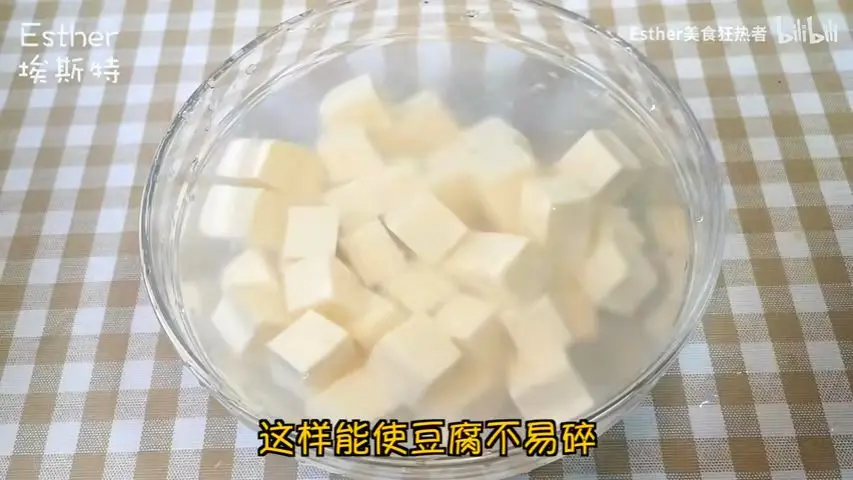
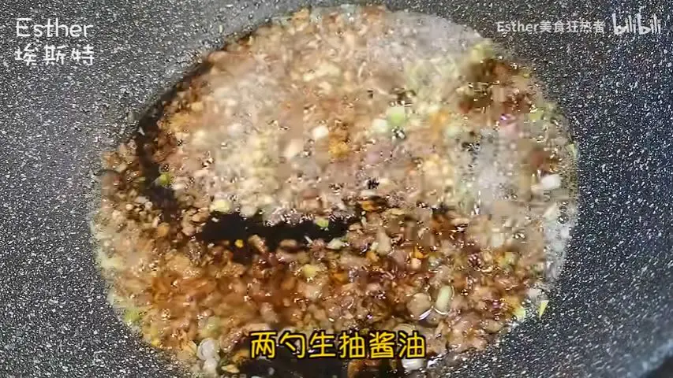
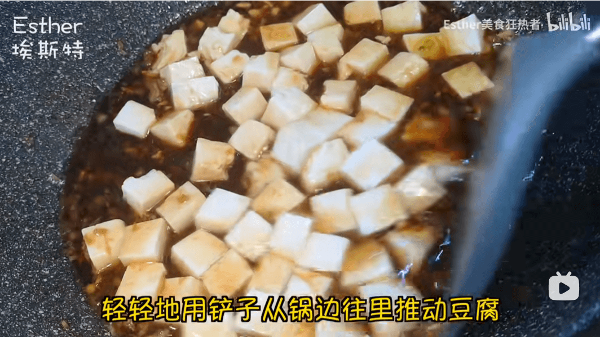
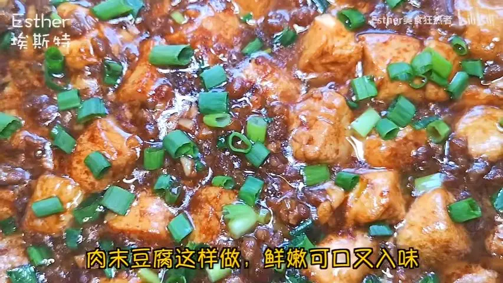

# 肉末豆腐的做法

## 必备原料和工具

- 肉末
- 嫩豆腐或内酯豆腐
- 白糖
- 生抽
- 盐
- 生姜
- 蒜
- 料酒
- 小葱

## 计算

按照 1 盘的份量：

- 白糖 10 克
- 生抽 15 克
- 老抽 3 克
- 盐 2 克
- 生姜 2 片
- 蒜 2 瓣
- 料酒 20 毫升
- 小葱挽成结

## 操作

- 1.准备一块嫩豆腐或者内酯豆腐，切成 1.5 厘米左右的小方块，水里加盐，将切好的豆腐放入水中浸泡一会儿，这样能使豆腐不易碎。葱白葱叶分开，葱白切碎，葱叶切成葱花，姜蒜拍扁切成末，锅里放油。肉末下锅，快速将肉末炒散。

- 2. 耐心地把肉末炒香，炒干水分，加入葱、姜、蒜爆香，爆香后从锅边淋入一勺料酒，两勺生抽、酱油。快速搅匀，激发出酱香味，加入一碗清水煮开，加半勺老抽调色，搅拌均匀。加入沥干水的豆腐。轻轻的用铲子从锅边往里推冻豆腐，使豆腐入味均匀

- 3. 千万不要随意翻动豆腐，否则豆腐易碎。味道如果不够的话，补一勺盐，再加少许糖，提鲜胚冻豆腐，使味道均匀。小火煮至豆腐入味，倒入淀粉水，勾一层薄薄的芡。将汤汁收至浓稠，最后撒上葱花即可起锅。肉末豆腐完成。

## 附加内容

- [肉末和豆腐超下饭的做法，鲜嫩可口又入味，营养丰富，老少皆宜！](https://www.bilibili.com/video/BV1iF411e7DM/?spm_id_from=333.999.0.0&vd_source=b080c1e3a5d9d4c1b7d7de6c5e93368e)

如果您遵循本指南的制作流程而发现有问题或可以改进的流程，请提出 Issue 或 Pull request 。
