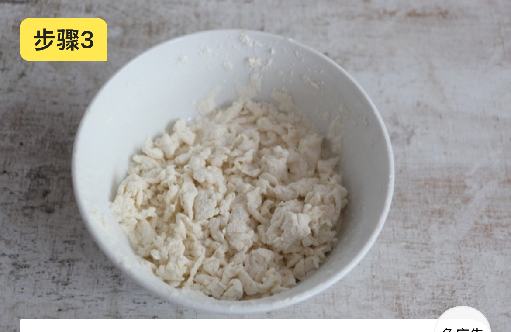

# 疙瘩汤的做法

## 必备原料和工具

- 西红柿
- 鸡蛋
- 香油
- 盐
- 葱、姜、蒜

## 计算

- 西红柿 1 个
- 鸡蛋 1-2 个（依照自己的口味而定，一般就放 2 个）
- 香油 2 滴
- 盐 15 克
- 葱、姜、蒜共 15 克

## 操作

1. 西红柿切小丁，尽量切得小一些
2. 面粉里缓缓的滴入水滴，将面粉搅拌成絮状

(注意疙瘩不能拌的太大了，否则会煮不熟)

3. 锅中倒入少许食用油，放入西红柿翻炒，少加盐（只给西红柿）。
4. 翻炒至西红柿出汁
5. 加入适量水烧开
6. 将面粉缓缓倒入锅中
7. 再次煮开
8. 鸡蛋打散，淋入锅中
9. 撒少许盐调味
10. 撒入葱花即可出锅

成品展示

## 附加内容

如果您遵循本指南的制作流程而发现有问题或可以改进的流程，请提出 Issue 或 Pull request 。
